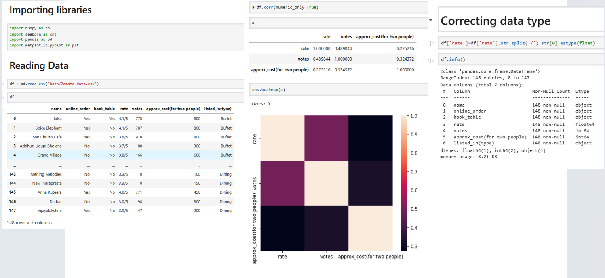
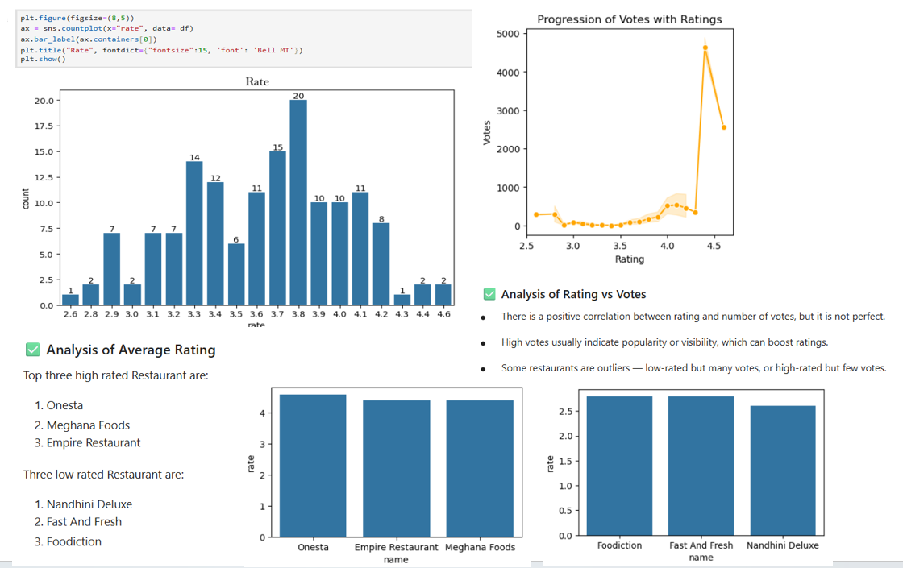
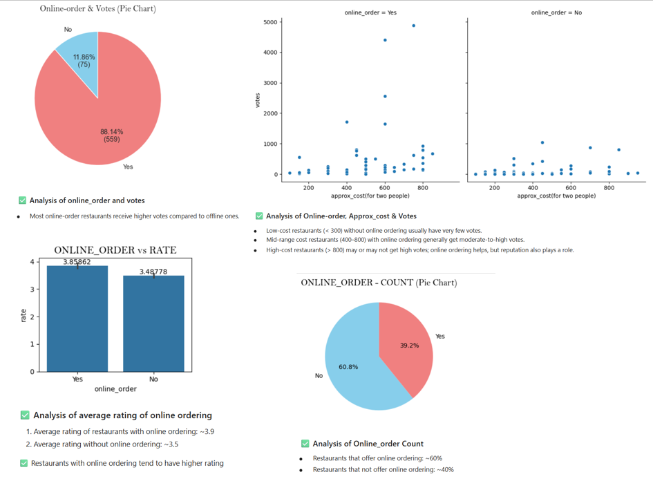
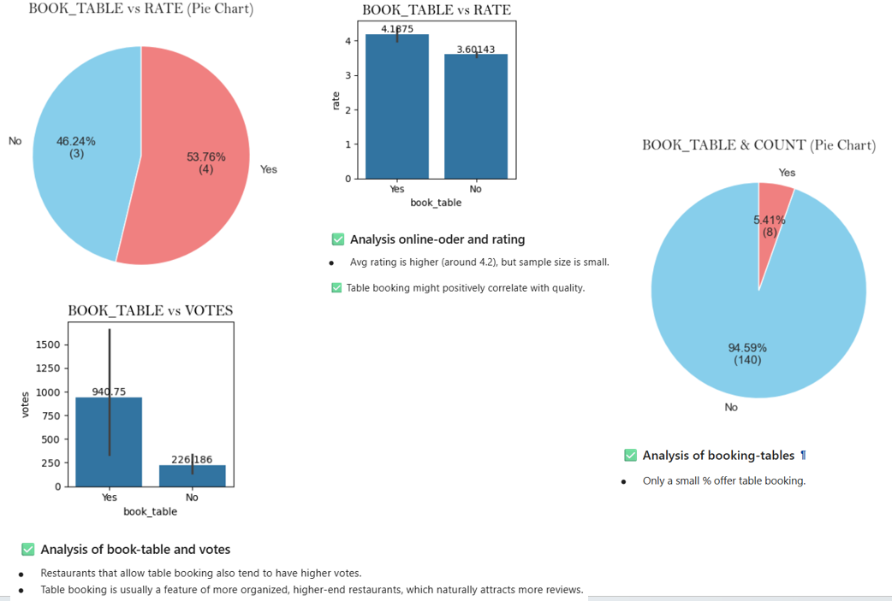
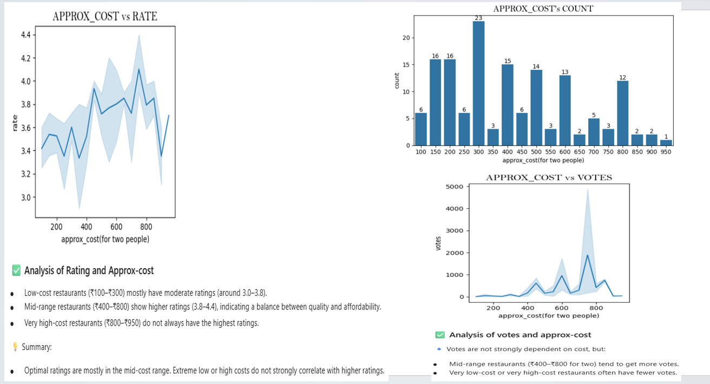
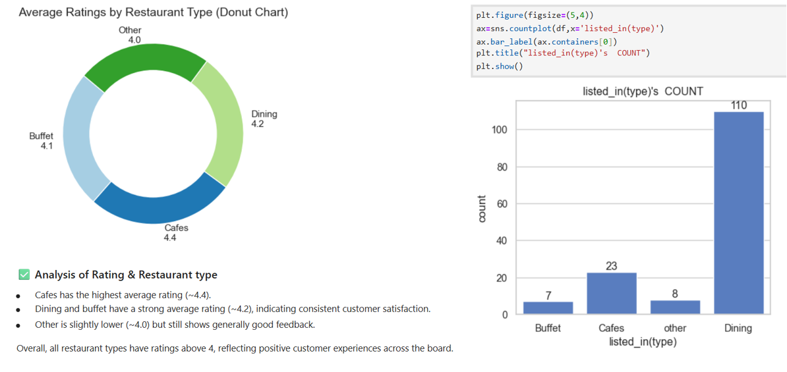
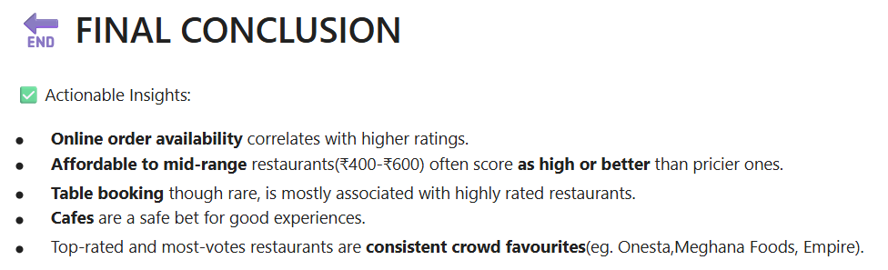

# 🍴 Zomato Data Analysis & Insights

## 📊 Overview

This project explores and analyzes the Zomato restaurant dataset, uncovering patterns in dining preferences, cuisines, ratings, and pricing across different cities.
The goal is to extract actionable insights that can help restaurant owners, food lovers, and data enthusiasts understand the dynamics of the food industry.

---

## 🚀 Features

✨ Comprehensive EDA – Cleaned and visualized restaurant data using Python (Pandas, Matplotlib, Seaborn, Plotly).
📍 Location Insights – Found top-rated restaurants by city and locality.
🍽️ Cuisine Analysis – Identified trending cuisines and their price ranges.
⭐ Rating Distribution – Explored correlations between price, service, and customer ratings.
💰 Cost & Popularity Trends – Visualized how average cost varies by cuisine and location.

---

## 🧰 Tech Stack
Category	Tools / Libraries
Programming	Python
Data Handling	Pandas, NumPy
Visualization	Matplotlib, Seaborn, Plotly
Notebook	Jupyter Notebook / Google Colab

---

## 📂 Project Structure
├── data/ &nbsp; &nbsp; &nbsp; &nbsp; &nbsp; &nbsp;  
├── Zomato's data.csv  &nbsp; &nbsp; &nbsp; &nbsp; &nbsp; &nbsp;  
├── screenshots/&nbsp;&nbsp;&nbsp; &nbsp; &nbsp; &nbsp; &nbsp; &nbsp; &nbsp;  &nbsp;  
&nbsp;&nbsp;&nbsp;├── Zomato1.png  
&nbsp;&nbsp;&nbsp;├── Zomato2.png  
&nbsp;&nbsp;&nbsp;├── Zomato3.png  
&nbsp;&nbsp;&nbsp;├── Zomato4.png  
&nbsp;&nbsp;&nbsp;├── Zomato5.png  
&nbsp;&nbsp;&nbsp;├── Zomato6.png  
&nbsp;&nbsp;&nbsp;├── Zomato7.png  
├── Zomato_dataset_project.ipynb  
├── README.md

---

## 🖼️ Screenshots

 

---

## 🧠 Future Scope

Build a machine learning model to predict restaurant ratings.

Create an interactive dashboard using Power BI / Tableau.

Expand analysis with sentiment analysis on user reviews.

---

## 🧑‍💻 Author

👤 **[Kanika Rana]**  
📧 [ranakanika103.com]  
🌐 [https://www.linkedin.com/in/kanika-rana-0681b4372/]  

---

## ⭐ Show Your Support

If you found this project useful, don’t forget to give it a ⭐ on GitHub!